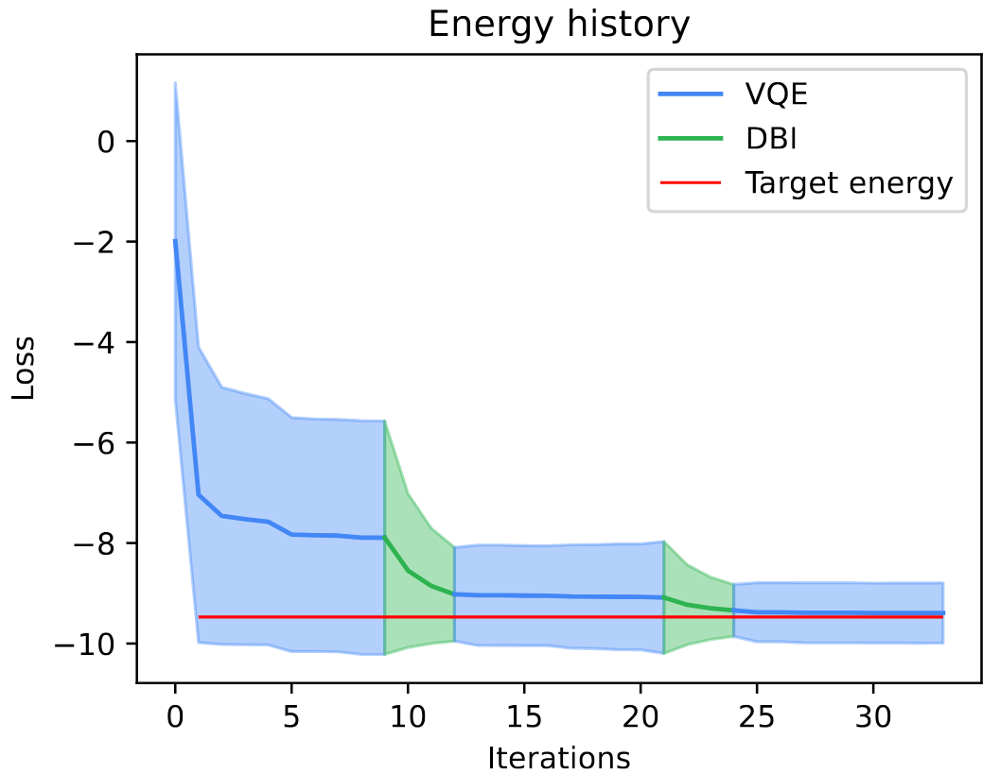

# Boost VQEs with DBI

Boosting variational eigenstate preparation algorithms limited by training and not device coherence by diagonalization double-bracket iteration.

The code is organized as follows:

* `main.py`: performs boosted VQE training
* `ansatze.py`: contains circuit used by VQE
* `utils.py`: contains utils function used by `main.py`
* `plotscripts.py`: plotting functions.
* `run.sh`: bash script example using `main.py`

## How to run the code

```sh
python main.py --help
```

```sh
usage: main.py [-h] [--backend BACKEND] [--platform PLATFORM] [--nthreads NTHREADS] [--optimizer OPTIMIZER] [--tol TOL]
               [--nqubits NQUBITS] [--nlayers NLAYERS] [--output_folder OUTPUT_FOLDER] [--nboost NBOOST]
               [--boost_frequency BOOST_FREQUENCY] [--dbi_steps DBI_STEPS] [--stepsize STEPSIZE]
               [--optimize_dbi_step OPTIMIZE_DBI_STEP] [--hamiltonian HAMILTONIAN]

VQE with DBI training hyper-parameters.

options:
  -h, --help            show this help message and exit
  --backend BACKEND     Qibo backend
  --platform PLATFORM   Qibo platform (used to run on GPU)
  --nthreads NTHREADS   Number of threads used by the script.
  --optimizer OPTIMIZER
                        Optimizer used by VQE
  --tol TOL             Absolute precision to stop VQE training
  --nqubits NQUBITS     Number of qubits for Hamiltonian / VQE
  --nlayers NLAYERS     Number of layers for VQE
  --output_folder OUTPUT_FOLDER
                        Folder where data will be stored
  --nboost NBOOST       Number of times the DBI is used in the new optimization routine. If 1, no optimization is run.
  --boost_frequency BOOST_FREQUENCY
                        Number of optimization steps which separate two DBI boosting calls.
  --dbi_steps DBI_STEPS
                        Number of DBI iterations every time the DBI is called.
  --stepsize STEPSIZE   DBI step size.
  --optimize_dbi_step OPTIMIZE_DBI_STEP
                        Set to True to hyperoptimize the DBI step size.
  --hamiltonian HAMILTONIAN
                        Hamiltonian available in qibo.hamiltonians.
(test_env) andreapasquale@TII-APASQUALE01:~/boostvqe(readme)$

```




#### basically, do VQE, VQA and DBI together and seach for improvements

#### Marek goal

This should be viewed as the faster paced project where we just search for advantages and showcase ideas.

Here we are preparing the more detailed analysis
https://github.com/qiboteam/dbi_variational_strategies/

Here is the edit link (please be careful sharing, thanks)
https://www.overleaf.com/1329774127ntmdnsfbwykd#96b12e
and here is the read link e.g. for interested students
https://www.overleaf.com/read/crtmjkgvxqrd#79cd6e

Marek revised draft (should be on arxiv still 2023)
https://www.overleaf.com/read/tpppsvxynsrn#b66556
