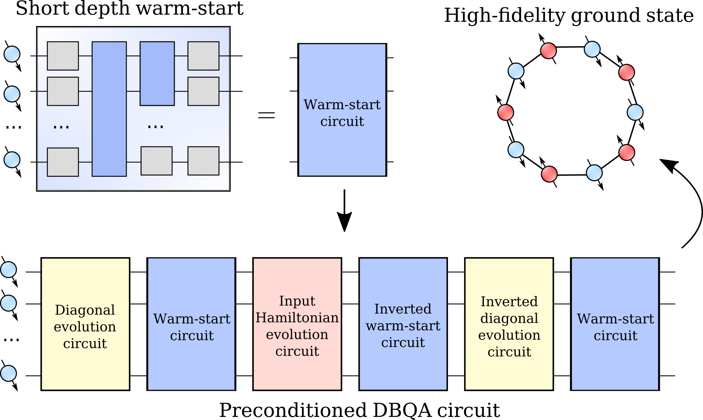

# Boost VQEs with DBI


Boosting variational eigenstate preparation algorithms limited by training and not device coherence by diagonalization double-bracket iteration.

## Setup

Given you have `poetry` installed

```sh
poetry install && poetry shell
```

will install `boostvqe 0.0.1` and activate a dedicated working shell.

## Code structure

The code is organized as follows:

* `main.py`: performs boosted VQE training
* `run.sh`: bash script example using `main.py`

The source code is located in `./src/boostvqe/.` and its composed of:

* `ansatze.py`: contains circuit used by VQE
* `utils.py`: contains utils function used by `main.py`
* `plotscripts.py`: plotting functions.

## How to run the code

```sh
python main.py --help
```

```sh

usage: main.py [-h] [--backend BACKEND] [--platform PLATFORM]
               [--nthreads NTHREADS] [--optimizer OPTIMIZER]
               [--optimizer_options OPTIMIZER_OPTIONS] [--tol TOL]
               [--decay_rate_lr DECAY_RATE_LR] [--nqubits NQUBITS]
               [--nlayers NLAYERS] [--output_folder OUTPUT_FOLDER]
               [--nboost NBOOST] [--boost_frequency BOOST_FREQUENCY]
               [--dbi_steps DBI_STEPS] [--stepsize STEPSIZE]
               [--optimize_dbi_step OPTIMIZE_DBI_STEP]
               [--store_h | --no-store_h] [--hamiltonian HAMILTONIAN]
               [--seed SEED] [--nshots NSHOTS]

VQE with DBI training hyper-parameters.

optional arguments:
  -h, --help            show this help message and exit
  --backend BACKEND     Qibo backend
  --platform PLATFORM   Qibo platform (used to run on GPU)
  --nthreads NTHREADS   Number of threads used by the script.
  --optimizer OPTIMIZER
                        Optimizer used by VQE
  --optimizer_options OPTIMIZER_OPTIONS
                        Options to customize the optimizer training
  --tol TOL             Absolute precision to stop VQE training
  --decay_rate_lr DECAY_RATE_LR
                        Decay factor of the learning rate if sgd is used
  --nqubits NQUBITS     Number of qubits for Hamiltonian / VQE
  --nlayers NLAYERS     Number of layers for VQE
  --output_folder OUTPUT_FOLDER
                        Folder where data will be stored
  --nboost NBOOST       Number of times the DBI is used in the new
                        optimization routine. If 1, no optimization is run.
  --boost_frequency BOOST_FREQUENCY
                        Number of optimization steps which separate two DBI
                        boosting calls.
  --dbi_steps DBI_STEPS
                        Number of DBI iterations every time the DBI is called.
  --stepsize STEPSIZE   DBI step size.
  --optimize_dbi_step OPTIMIZE_DBI_STEP
                        Set to True to hyperoptimize the DBI step size.
  --store_h, --no-store_h
                        H is stored for each iteration
  --hamiltonian HAMILTONIAN
                        Hamiltonian available in qibo.hamiltonians.
  --seed SEED           Random seed
  --nshots NSHOTS       number of shots
```
# Reference and citation policy

For more details about this project and citations, please refer to [the article](https://www.arxiv.org/abs/2408.03987).


